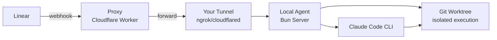

# Sniff - Local-First AI Agents for Linear

> Declarative AI agents that run on your machine. Like Docker Compose for AI agents.

Deploy AI agents with a simple YAML config. Code execution stays local, only webhook routing goes through the cloud.

## Architecture



- **Local-first**: Agents run on your machine with full codebase access
- **Isolated execution**: Each issue gets its own git worktree
- **Multi-runner support**: Claude Code, Gemini CLI, Codex CLI (coming soon)
- **No database**: Config from YAML, tokens stored locally in `~/.sniff/`

## Quick Start

```bash
# Install Bun if you haven't
curl -fsSL https://bun.sh/install | bash

# Clone and install
git clone https://github.com/sniff-dev/sniff
cd sniff
bun install

# Initialize config
bun run apps/cli/src/index.ts init

# Set up environment
cp .env.example .env
# Edit .env with your proxy URL

# Authenticate with Linear
bun run apps/cli/src/index.ts auth linear

# Start the agent
bun run apps/cli/src/index.ts start
```

## Configuration

**sniff.yml** - Agent definitions (commit to git):

```yaml
version: "1.1"

agents:
  - id: triage-agent
    name: Triage Agent
    system_prompt: |
      You are a triage agent. When assigned an issue:
      1. Analyze the issue description
      2. Explore the codebase for context
      3. Suggest next steps or solutions

    runner:
      type: claude
      max_turns: 10
      allowed_tools:
        - Read
        - Glob
        - Grep

    triggers:
      labels:
        - triage
        - bug
```

**.env** - Environment config (do not commit):

```bash
SNIFF_PROXY_URL=https://your-proxy.workers.dev
SNIFF_PORT=3847
LINEAR_WEBHOOK_SECRET=xxx  # optional
```

## CLI Commands

```bash
sniff init              # Create sniff.yml and .env.example
sniff validate          # Validate configuration
sniff auth linear       # Authenticate with Linear (OAuth)
sniff start             # Start local agent server
sniff stop              # Stop running agent
sniff status            # Show agent and tunnel status
sniff logs              # View execution logs
```

## How It Works

1. **Linear webhook fires** → Issue created/updated with matching label
2. **Proxy forwards** → Cloudflare Worker routes to your tunnel
3. **Local server receives** → Validates webhook, finds matching agent
4. **Worktree created** → Git worktree for isolated execution
5. **Runner executes** → Claude Code CLI runs with your system prompt
6. **Results posted** → Agent response appears in Linear

## Project Structure

```
sniff/
├── apps/
│   ├── cli/              # CLI application
│   └── proxy/            # Cloudflare Worker
├── packages/
│   ├── core/             # Shared types, env config, logger
│   ├── config/           # Zod schemas, YAML loading
│   ├── linear/           # Webhook parsing, API client
│   ├── orchestrator/     # Server, worktree manager
│   ├── runner-claude/    # Claude Code CLI wrapper
│   └── storage/          # Filesystem storage (~/.sniff/)
├── sniff.yml             # Your agent configuration
├── sniff.yml.example     # Example configuration
└── .env.example          # Environment template
```

## Environment Variables

| Variable | Required | Default | Description |
|----------|----------|---------|-------------|
| `SNIFF_PROXY_URL` | Yes | - | Your deployed proxy URL |
| `SNIFF_PORT` | No | `3847` | Local server port |
| `LINEAR_WEBHOOK_SECRET` | No | - | Webhook signature verification |

Tokens are stored locally in `~/.sniff/tokens/` after running `sniff auth`.

**Note:** Start your tunnel manually (e.g., `ngrok http 3847`) and set `TUNNEL_URL` in `apps/proxy/.env`.

## Development

```bash
# Install dependencies
bun install

# Run CLI in development
bun run apps/cli/src/index.ts [command]

# Type check
bun run typecheck

# Lint
bun run lint

# Run tests
bun test
```

## Proxy Deployment

Deploy the Cloudflare Worker to receive webhooks:

```bash
cd apps/proxy
bunx wrangler deploy
```

Then set `SNIFF_PROXY_URL` in your `.env` and configure Linear webhooks to point to `https://your-proxy.workers.dev/webhook/linear`.

## License

MIT

## Support

- **Issues**: [github.com/sniff-dev/sniff/issues](https://github.com/sniff-dev/sniff/issues)
- **Discord**: [discord.gg/huk9sSQCJA](https://discord.gg/huk9sSQCJA)
