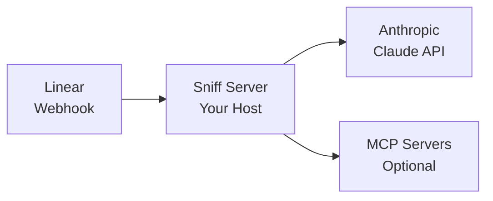

# How It Works

Sniff connects Linear to Claude through webhooks. When something happens in Linear, your agent analyzes it and responds.

## Architecture



## The Agent Lifecycle

### 1. Event Received

When an issue is created or updated in Linear, a webhook is sent to your Sniff server:

```json
{
  "action": "create",
  "type": "Issue",
  "data": {
    "id": "abc-123",
    "title": "Login button not working",
    "description": "Users report the login button is unresponsive..."
  }
}
```

### 2. Agent Selected

Sniff matches the event to your configured agent(s). The agent's system prompt defines how it should respond.

### 3. Claude Processes

The issue context is sent to Claude along with your system prompt:

```
System: You are a triage specialist...

User: New issue created:
Title: Login button not working
Description: Users report the login button is unresponsive...
```

### 4. Tools Execute (Optional)

If your agent has tools configured, Claude can:

- **Search the web** for documentation or error codes
- **Fetch web pages** for detailed content
- **Call MCP servers** for external integrations

### 5. Response Posted

Claude's response is posted as a comment on the Linear issue:


```markdown
### Triage Analysis

**Type:** Bug
**Priority:** P1 (High)

**Reasoning:**
This affects core authentication functionality. Users cannot
access the application, making this a high-priority issue.

**Suggested Labels:**

- `bug`
- `auth`
- `frontend`

**Next Steps:**

1. Assign to frontend team
2. Check recent auth-related changes
```

## Interacting with Agents

### @Mention

Users can @mention Sniff in any issue to trigger analysis:


### Assign to Sniff

Assign an issue directly to Sniff for automatic handling:


## What Sniff Can Access

When processing an issue, your agent receives:

- **Issue title and description**
- **Labels and priority**
- **Assignee and creator info**
- **Team and project context**
- **Recent comments**

## Stateless Design

Sniff is stateless by design:

- **No database** - Configuration comes from `sniff.yml`
- **No session storage** - Each webhook is processed independently
- **Credentials from env vars** - `LINEAR_ACCESS_TOKEN`, `ANTHROPIC_API_KEY`

This makes deployment simple and scaling straightforward.

## Multiple Agents

You can define multiple agents in your configuration:

```yaml
version: '1.0'

agents:
  - id: 'triage-bot'
    name: 'Triage Assistant'
    # ...

  - id: 'docs-bot'
    name: 'Documentation Helper'
    # ...
```

Each agent has its own system prompt and model configuration.

## Next Steps

<CardGroup cols={2}>
  <Card title="Configuration" icon="code" href="/configuration">
    Customize your agent's behavior
  </Card>
  <Card title="Schema Reference" icon="book" href="/schema-reference">
    Full configuration options
  </Card>
</CardGroup>
