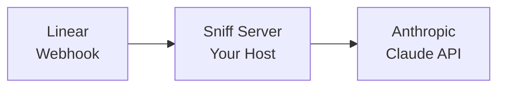

# What is Sniff?

Sniff is a self-hosted AI agent framework for Linear. Define your agents in YAML, deploy with Docker, and let AI handle your issue triage, research, and analysis.

Like Docker Compose for AI agents.

## Why Sniff?

- **Self-hosted** - Run on your infrastructure. No vendor lock-in, no data leaving your network
- **Declarative** - Define agents in YAML. Version control your configuration
- **Simple** - No database required. Stateless design with config from a single file
- **Extensible** - Web search, web fetch, and MCP server integrations built-in

## How It Works



1. **Linear sends webhook** → Issue created or updated
2. **Sniff processes event** → Matches to your agent configuration
3. **Agent runs** → Claude analyzes with your system prompt
4. **Response posted** → Agent reply appears as Linear comment

## What Can Agents Do?

With Sniff, you can build agents that:

- **Triage issues** - Classify type, set priority, suggest labels
- **Research questions** - Search docs and provide answers with citations
- **Analyze bugs** - Look up error codes, find similar issues
- **Summarize discussions** - Condense long threads into key points

## Example Configuration

```yaml
version: '1.0'

agents:
  - id: 'triage-bot'
    name: 'Triage Assistant'
    system_prompt: |
      You are a triage specialist.
      Classify issues as bug/feature/question/task.
      Set priority P0-P3.
    model:
      anthropic:
        name: 'claude-sonnet-4-20250514'
        temperature: 0.3
        max_tokens: 1500
```

## Get Started

Ready to deploy your first agent?

<Card title="Quickstart" icon="rocket" href="/quickstart">
  Deploy an agent in 5 minutes with Docker
</Card>
